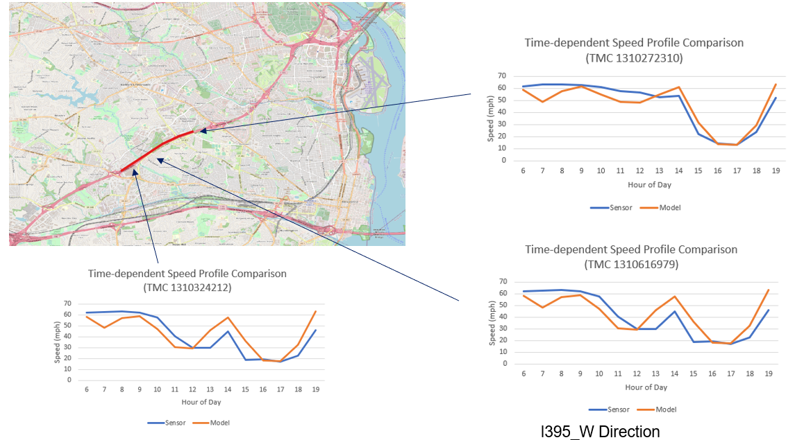
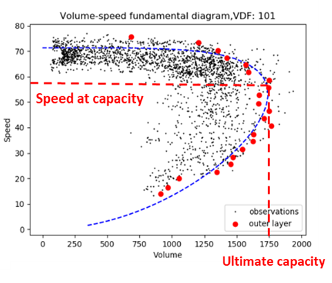

USER GUIDE

TMC2GMNS aims to create a node-link network based on file
TMC_Identification.csv, and then identify critical bottleneck statistics, such
as cut-off speed, congestion duration, the D/C ratio in the queued VDF function,
according to the speed data in reading.csv.

The node and link csv files can be visualized easily using QGIS.

The user can run the executable of tmc2gmns.exe to generate link_cbi_summary.csv
file.

The user can use link_cbi_summary.csv to generate speed heatmaps for both
observed and modeled values for each hour or 15 min. The output sequence of
links in link_cbi_summary.csv is based on fields tmc_corridor_id and
road_sequence input in TMC_Identification.csv.

Example output:

Where VMT: Vehicle miles travelled

VHT: Vehicle hours travelled

VDT: total vehicle delay travelled, delay = travel time – free flow travel time

(VHT = VDT+VFFTT = VDT + VMT/free speed)

VCDT: total vehicle “congestion” delay travelled: travel time – travel time at
capacity

Travel time at capacity = length / speed at capacity.

Where MAE: Mean Absolute Error,

MAE= \|Model speed – observed speed\|

MAPE: Mean Absolute Percentage Error,

MAPE= \|Model speed – Observed speed\|/observed speed

RMSE: Root-Mean Squared Error

RMSE= Average((Model speed – Observed speed)\^2)\^0.5

Sample of observed and simulated speed profiles

A future version will enable sensitivity analysis for generating estimated
congestion duration based on change in the D/C ratio.

**Detailed Description**

**Input: Reading.csv, TMC_Identification.csv**

field definitions in Reading.csv

| **Field name**      | **Read by tmc2gmsn**                                    | **Description**                                  | **Sample values** |
|---------------------|---------------------------------------------------------|--------------------------------------------------|-------------------|
| tmc_code            | yes                                                     | TMC identification number of the link            | 115N04140         |
| measurement_tstamp  | yes, pls follow the ISO 8601 format 2022-05-23T13:18:34 | Time stamp of the observed data                  | 2019/1/1 6:00:00  |
| speed               | Yes                                                     | Observed speed                                   | 66                |
| average_speed       | No                                                      | Observed average speed                           | 66                |
| reference_speed     | No                                                      | Unknown                                          | 69                |
| travel_time_seconds | No                                                      | Travel time of the TMC link (time unit: seconds) | 58.79             |
| confidence_score    | No                                                      | Confden                                          | 20                |
| cvalue              | No                                                      | Confidence level range                           | 100               |

field definitions in TMC_Identification.csv

| **Field name**    | **Description**                                 | **Sample values**         |
|-------------------|-------------------------------------------------|---------------------------|
| Tmc               | TMC identification number of the link           | 115N04140                 |
| Road              | The corridor where the TMC link locates         | AZ-101-LOOP               |
| Direction         | The direction of the TMC link                   | EASTBOUND                 |
| Intersection      | Observed average speed on the TMC link          | I-17/EXIT 23              |
| State             | The state where the TMC link locates            | AZ                        |
| County            | The county where the TMC link locates           | MARICOPA                  |
| Zip               | zip code                                        | 85027                     |
| start_latitude    | The latitude of the origin node                 | 33.66864                  |
| start_longitude   | The longitude of the origin node                | -112.11639                |
| end_latitude      | The latitude of the destination node            | 33.66952                  |
| end_longitude     | The longitude of the destination node           | -112.09772                |
| miles             | The distance of the TMC link (time unit: miles) | 1.077861                  |
| road_order        | The order of the TMC link in its corridor       | 14                        |
| timezone_name     | The timezone where the TMC link locates         | America/Phoenix           |
| type              | Unknown                                         | P1.11                     |
| country           | The country where the TMC link locates          | USA                       |
| active_start_date |  Starting date of TMC activation                | 2018-12-03 12:00:00-05:00 |
| active_end_date   | Ending date of TMC activation                   | 2019-04-16 17:00:00-04:00 |

**Output: node.csv, link.csv, link_cbi_summary.csv, link_qvdf.csv**

Field definitions in node.csv

| **Field name**       | **Description**                                          | **Sample values** |
|----------------------|----------------------------------------------------------|-------------------|
| node_id              | Identification number of the node                        | 1                 |
| node_no              |                                                          | 0                 |
| layer_no             |                                                          | 0                 |
| MRM_gate_flag        |                                                          | default value:-1  |
| node_type            | Node type code                                           |                   |
| is_boundary          | Identification flag of the boundary node                 | 0                 |
| \#_of_outgoing_nodes | The number of outgoing nodes from the node               | 6                 |
| activity_node_flag   | Identification flag of the activity node                 | 0                 |
| agent_type           | Agent type code                                          |                   |
| zone_id              | Identification number of the zone where the node locates | default value:-1  |
| cell_code            | Identification number of the cell node                   |                   |
| info_zone_flag       | Identification flag of the zone information              | 0                 |
| x_coord              | Longitude coordinate                                     | -112.11639        |
| y_coord              | Latitude coordinate                                      | 33.66864          |

Field definitions in link.csv

| **Field name**    | **Description**                                                     | **Sample values**                                        |
|-------------------|---------------------------------------------------------------------|----------------------------------------------------------|
| link_id           | Identification number of the node                                   | 115N04140                                                |
| link_no           | Unknown                                                             | 0                                                        |
| layer_no          | Unknown                                                             | 0                                                        |
| from_node_id      | Unknown                                                             | 1                                                        |
| to_node_id        | Node type code                                                      | 2                                                        |
| from_gate_flag    | Identification flag of the boundary node                            | default value:-1                                         |
| to_gate_flag      | The number of outgoing nodes from the node                          | default value:-1                                         |
| link_type         | Identification flag of the activity node                            | 2                                                        |
| link_type_name    | Agent type code                                                     |                                                          |
| lanes             | Identification number of the zone where the node locates            | default value:0                                          |
| link_distance_VDF | Identification number of the cell node                              | 1.077861                                                 |
| free_speed        | Identification flag of the zone information                         | 100                                                      |
| cutoff_speed      | Longitude coordinate                                                | 100                                                      |
| fftt              | Latitude coordinate                                                 | 1.077861                                                 |
| capacity          | The value of ultimate capacity                                      | 1800                                                     |
| allow_uses        | Allowed uses of the link                                            |                                                          |
| BPR_plf           | The value of peak load factor (plf) in classical BPR function       | 1                                                        |
| BPR_alpha         | The value of alpha in classical BPR function                        | default value: 0.15                                      |
| BPR_beta          | The value of alpha in classical BPR function                        | default value: 4                                         |
| QVDF_qdf          | The value of queue demand factor (qdf) in QVDF function             | default value: -1                                        |
| QVDF_alpha        | The value of alpha in QVDF function                                 | 0.272877                                                 |
| QVDF_beta         | The value of beta in QVDF function                                  | 4                                                        |
| QVDF_cd           | The value of a coefficient in QVDF function                         | 0.954946                                                 |
| QVDF_n            | The value of oversaturation-to-duration elasticity in QVDF function | 1.141574                                                 |
| geometry          | Geometry                                                            | LINESTRING (-112.116390 33.668640,-112.097720 33.669520) |

**Description of calibration process**

# Calibration of Fundamental Diagram and DTA queue model

**(1) Calibration of Fundamental Diagram**

****

**Input:** observed speed and observed volume (time is in 5-min time interval)

**Output:** ultimate capacity , critical density , critical speed and shape
parameter

**(2) Calibration of DTA queue model**

**Input:** critical speed ; observed speed

**Output:**

**Steps:**

a. Determine the start and end time of congestion period for each link, denoted
as and , respectively depending on time dependent speed and critical speed. **We
derive  and for each link on each assignment period (AM, MD, PM) based on
average weekeday.**

b. Calculate congestion duration for each link for each **assignment period (AM,
MD, PM)**

c. Calculate derived link volume through calibrated S3 model

d. Calculate congested demand

e. Calculate queue demand factor for each link based on **= D/V.**

# Derive link volume

**Method 1:** Adjust link volume through ODME and derive new link volume as

**Method 2:** Use calibrated S3 model to derive volume

# Comparison between estimated and observed speed

**Input:**

derived link volume ; queue demand factor

**Output:** estimated speed; MAE; MAPE

a. Calculate queue demand factor

b. Calculate queued demand

c. Calibrate

d. Calculate through

e. Calculate through

f. Calculate estimated speed

g. Calculate MAE and MAPE

# Future year scenario analysis

**Steps:**

a. Implement static traffic assignment (using future year OD as ) and derive
assigned link volume

b. Calculate future year congestion demand

c. Calculate congestion period

d.-g. Follow the same steps as above in Section 3

Comments:

The mapping from TMC locations to the planning network requires another tool of
map matching4GMNS to systematically distinguish general purpose lanes and toll
lanes.

In the illustrative example below, we show how to verify the correct mapping
based on the path length of the corridor in both planning network and TMC
network.

